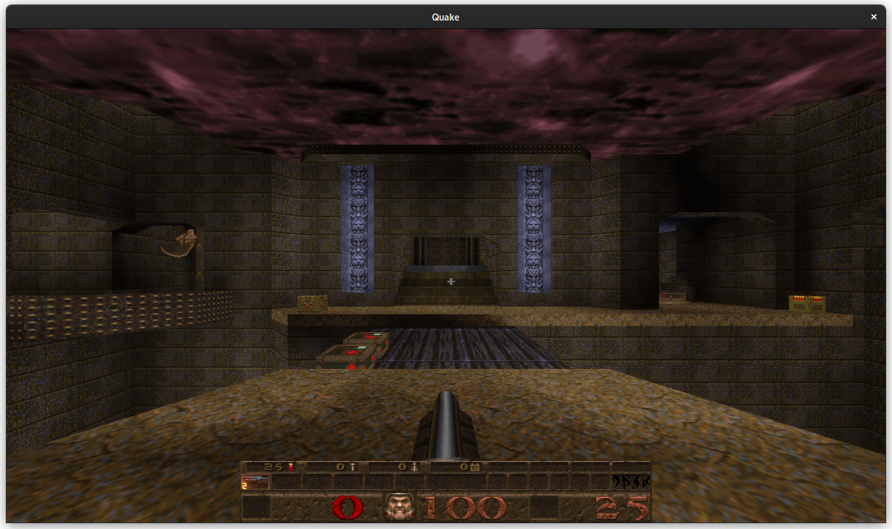

# Seismon

### An extensible, modern Quake engine

> #### NOTE
>
> This branch is for a migration away from "hand-rolled" solutions for things like state storage, rendering and networking.
>
> This currently includes:
>
> - [`bevy_mod_scripting`](https://github.com/eira-fransham/bevy_mod_scripting_qcvm) for the QuakeC VM
> - [`bevy_trenchbroom`](https://github.com/eira-fransham/bevy_trenchbroom/tree/each-model-separate-sub-asset-bevy-0.18) for the map loading/rendering
>
> and in the future, will include using `lightyear` or a similar mechanism for networking, along with some other improvements.
>
> The hope is that once this refactor is completed, Seismon will be able to use Lua as an alternate scripting language, will be able to load non-Quake 1
> maps and models (e.g. Half-Life), and will be able to run in FTEQW- or DarkPlaces-compatible modes, as well as potentially supporting Quake 3's map
> and VM formats.
>
> Currently, it is less functional than the default [`bevy`](https://github.com/eira-fransham/seismon/tree/bevy) branch, but improvements are being made.

#### Click here for a preview video:

[](https://www.youtube.com/watch?v=Hy5QStHHv8A)

Seismon is a Quake engine written in Rust, based on the [Bevy](https://bevyengine.org/) framework. It is extensible,
written in a modern ECS style, has a modern deferred and pipelined rendering system, and includes a modern audio
framework. The engine is built as a set of plugins, and much of the work could be extracted to work in other games,
particularly the console system. Work to extract these pieces out is ongoing (see
[#30](https://github.com/eira-fransham/seismon/issues/30)).

Bevy has a lot of features related to rendering, audio and state management that in my [previous Quake-related project](https://github.com/eira-fransham/goeld)
had to be implement manually - specifically, tonemapping/HDR and pipelined rendering. The audio system has also been completely
overhauled, originally with a custom-written Bevy module but now the system has been switched over to use
[`bevy_seedling`](https://github.com/CorvusPrudens/bevy_seedling/).

Based on [Richter](https://github.com/cormac-obrien/richter) by Cormac O'Brien, and still shares a lot of its DNA. Seismon
originally started as a quick weekend project to make Richter run on macOS, but I've now ended up spending months on it and
the diff is something like +40,000, -13,000 LoC.

To my knowledge, this is the first full from-scratch rewrite of Quake 1, i.e. not forked from the Quake 1 source code
release.


### Goals

The ultimate goal is for the renderer, client-server interactions, server, input and console to be separate modules that can
be mixed and matched without requiring all of them. As Quake already has a client-server model even in singleplayer games,
once the client is its own separate system that only communicates with the server through regular networking methods it
should be possible to write game logic in Rust (and therefore any scripting layer that integrates with Bevy, such as Lua)
and still have regular Quake clients connect to it, instead of being restricted to QuakeC.

These goals are partially completed, as the audio, rendering and input handling are already separate plugins, although
there are still some remaining interdependence issues.

The QuakeC interpreter is currently reasonably self-contained, but once the server is functional and all the relevant QuakeC functions
are implemented I hope to move it to use `bevy_mod_scripting` and for the entity field storage to be done via the ECS. This
will make it far easier to write Quake mods in languages other than QuakeC, such as Lua. The Quake networking protocol is
fairly extensible and the client knows little about the server's game logic, so without the limitations of QuakeC it should
be possible to implement fairly complex games while still letting the DOS version of Quake connect to your server.

### Status

The console and post-processing are done using regular Bevy primitives, with the console being rendered using `bevy-ui`.
The world and client updates are still handled with a centralised struct instead of components, making it impossible for
regular systems to interact with it. The console and keybinding system has been updated to be much more extensible, and
command implementations are just regular systems which can access any resource or component. All rendering is done through
the Bevy rendergraph, although the rendering code itself is still mostly written by hand using wgpu, albeit in a much more
extensible way than the original Richter implementation.

Audio is done using `bevy_seedling`, a modern audiograph-based audio system replacing Bevy's default. This lets us apply
effects to the audio, and while it is relatively simple for now it should allow for some more advanced features later.

Hosting a server has preliminary support - the server can run all the initialisation code in QuakeC, and it can
load into any level from the original game. The server can correctly load entities, run the initialisation routines for
the player and entities, do basic physics, and send the resultant information to the client. The client can send input, which
is passed to QuakeC, but as player physics are not yet fully implemented the input can't actually move the player. The next
steps are to finish the physics and implement a couple of routines that are needed to make monsters move around. Basic collision
with the world and entities appears to work, but the best it can do right now is make the player awkwardly scoot around the level
when they spawn clipped into an entity (like on some levels where you start on an ammo/health pickup). Here is an example of the
client connected to the local Seismon server running `e3m6`:



Networking is untested since beginning the rewrite, and I've been only using demos as a testcase. It is a priority to get this
working again once the client update code is ported to use the ECS. I haven't touched most of the networking code, so in
theory it should still work or only require minor changes. The main issue is that the very old version of the protocol
implemented by Richter is not used by any servers I could find - hopefully soon I can implement protocol 666 (FitzQuake's
protocol version) which will rectify this issue.

I've implemented mod support outside of the original `id1` directory, and so far all the mods that are designed to work with the
original Quake release work. I have tried Hipnotic, Rogue, Soul of Evil, Xmen: Ravages of Apocalypse, MALICE (all the cutscenes
work but some of the regular levels have strange issues where entities are displayed with the wrong models), Omen, and Alien Quake.
Playing demos from all of these mods work.

A host of bugs and limitations from the original Richter were fixed. Inputs are no longer handled by an enum and you can
define your own arbitrary `+action`/`-action` commands which can be bound, and arbitrary cvars which can have a system
attached which will run when the cvar is changed. Commands are also implemented as systems, and so can have access to global
state.

There are still a couple of small pieces of code that use nightly Rust, but I hope to fix those eventually.

### Help needed

See [issues](https://github.com/eira-fransham/seismon/issues) for an up-to-date list of what needs help implementing.

### Running

```bash
cd /path/to/quake
# To run Quake 1 (id1 folder)
cargo +nightly run --release --manifest-path /path/to/seismon --bin quake-client
# To run other games
cargo +nightly run --release --manifest-path /path/to/seismon --bin quake-client -- --game [GAME_NAME]
# To run commands on startup (may require editing `quake.rc`, as `startdemos xxx` in the .rc
# may overwrite commands from `stuffcmds`)
cargo +nightly run --release --manifest-path /path/to/seismon --bin quake-client -- +map e1m1
```

#### Feature checklist

- Networking
  - [x] NetQuake network protocol implementation (`sv_protocol 15`)
    - [x] Connection protocol implemented
    - [x] All in-game server commands handled
    - [x] Carryover between levels
  - [ ] FitzQuake extended protocol support (`sv_protocol 666`)
- Server
  - [x] Initialisation routines
  - [x] All opcodes implemented
  - [x] Basic physics
  - [ ] Complete physics
  - [ ] All builtins implemented
  - [x] Input handling
  - [x] Basic client connection handling
  - [ ] Full client connection
  - [x] Single-player clients
  - [ ] External clients
  - [ ] Diffing to prevent unnecessarily sending information
- Rendering
  - [x] Deferred dynamic lighting
  - [x] Particle effects
  - [x] Pipelined rendering
  - [x] Customizable UI
  - Brush model (`.bsp`) rendering
    - Textures
      - [x] Static textures
      - [x] Animated textures
      - [x] Alternate animated textures
      - [x] Liquid texture warping
      - [x] Sky texture scrolling
    - [x] Lightmaps
    - [x] Occlusion culling
  - Alias model (`.mdl`) rendering
    - [x] Keyframe animation
      - [x] Static keyframes
      - [x] Animated keyframes
    - [ ] Keyframe interpolation
    - [ ] Ambient lighting
    - [x] Viewmodel rendering
  - UI
    - [x] Console
    - [x] HUD
    - [x] Level intermissions
    - [x] On-screen messages
    - [x] Menus
- Use Bevy libraries instead of hand-rolling code
  - [x] Use `bevy_seedling` for audio
  - [ ] Use `hanabi` for particles
  - [x] Use `bevy-ui` for UI
  - [ ] Use standard Bevy rendering for the world/models
  - [ ] Support for rollback netcode using `matchbox`
  - [ ] Integrate an optional physics engine
- Sound
  - [x] Loading and playback
  - [x] Entity sound
  - [x] Ambient sound
  - [x] Spatial attenuation
  - [x] Stereo spatialization
  - [x] Music
  - [x] Global effects, particularly lookahead-enabled limiting to prevent audio clipping
- Console
  - [x] Line editing
  - [x] History browsing
  - [x] Cvar modification
  - [x] Shell-style completion
  - [x] Command execution
  - [x] Quake script file execution
- Demos
  - [x] Demo playback
  - [ ] Demo recording
- File formats
  - [x] BSP loader
  - [x] MDL loader
  - [x] SPR loader
  - [x] PAK archive extraction
  - [x] WAD archive extraction

## Legal

This software is released under the terms of the MIT License (see LICENSE.txt).

This project is in no way affiliated with id Software LLC, Bethesda Softworks LLC, or ZeniMax Media
Inc. Information regarding the Quake trademark can be found at Bethesda's [legal information
page](https://bethesda.net/en/document/legal-information).

Due to licensing restrictions, the data files necessary to run Quake cannot be distributed with this
package. `pak0.pak`, which contains the files for the first episode ("shareware Quake"), can be
retrieved from id's FTP server at `ftp://ftp.idsoftware.com/idstuff/quake`. The full game can be
purchased from a number of retailers including Steam and GOG.
